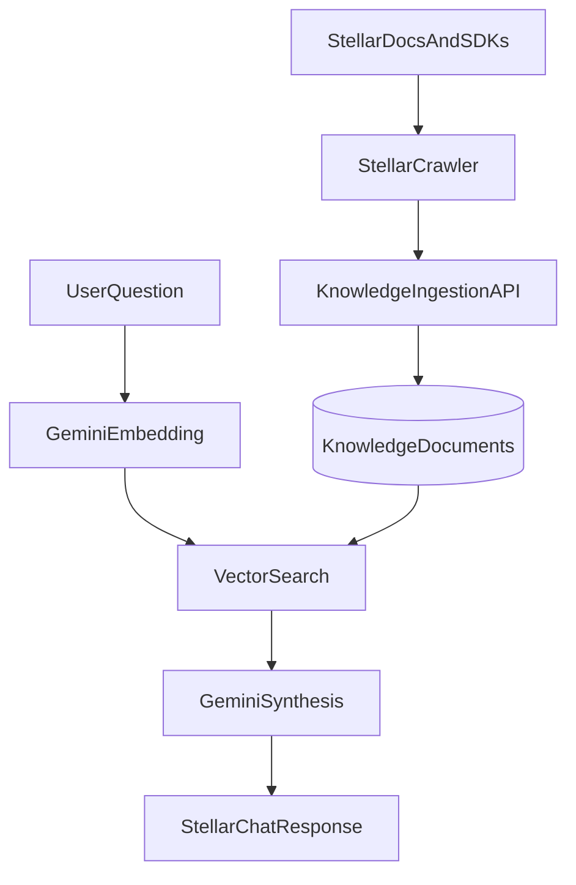

# Prumo Lite - Stellar RAG Chat

> Chat with Stellar docs and SDK references, tuned for Web2 developers learning the Stellar network.

## The Problem

Stellar documentation is strong, but it spans many pages, SDK repositories, and ecosystem concepts that are unfamiliar to developers coming from traditional Web2 systems.

Prumo Lite turns that material into a searchable knowledge base and exposes a chat endpoint that answers with retrieval-backed context instead of generic guesses.

## What It Does

- Crawls [developers.stellar.org/docs](https://developers.stellar.org/docs) and, on GitHub, these official repos (`.md` / `.mdx`): [stellar-core](https://github.com/stellar/stellar-core), [x402-stellar](https://github.com/stellar/x402-stellar), [stellar-docs](https://github.com/stellar/stellar-docs).
- Ingests documents into PostgreSQL with `pgvector`.
- Retrieves the most relevant documentation for a question.
- Uses Gemini to synthesize answers grounded in retrieved sources.
- Exposes a stateless `POST /chat/stellar` endpoint with source references.

## Stack

| Component | Technology |
|---|---|
| API | FastAPI + Pydantic v2 |
| Database | PostgreSQL 15+ with `pgvector` |
| ORM | SQLAlchemy 2.0 async |
| Retrieval | Gemini embeddings (`gemini-embedding-001`) + `pgvector` |
| Synthesis | Gemini 2.5 |
| Scraping | `httpx` + BeautifulSoup + GitHub API |
| Tooling | `uv`, Alembic, Ruff, mypy, pytest |

## Quick Start

```bash
uv sync
cp .env.example .env
uv run alembic upgrade head
uv run uvicorn app.main:app --reload
```

Create or reuse the Stellar project, then ingest sources:

```bash
uv run python scripts/ingest_stellar_docs.py
```

If you want to ingest a single source:

```bash
uv run python scripts/ingest_stellar_docs.py --source docs
uv run python scripts/ingest_stellar_docs.py --source github
```

## API

### Projects

- `POST /projects`
- `GET /projects`
- `GET /projects/{project_id}`

### Knowledge

- `POST /knowledge/documents`
- `GET /knowledge/projects/{project_id}/summary` (contagens por status; diagnostico RAG)
- `POST /knowledge/query`
- `DELETE /knowledge/documents/{document_id}`
- `DELETE /knowledge/purge-all`

### Chat

- `POST /chat/stellar`

### Cookbooks

- `GET /cookbooks`
- `POST /cookbooks/search/ui`
- `DELETE /cookbooks/{recipe_id}`

## Example Chat Request

```bash
curl -X POST http://localhost:8000/chat/stellar \
  -H "Content-Type: application/json" \
  -d '{
    "question": "What is the difference between a Stellar account and a regular bank account?",
    "session_id": "demo-session",
    "history": []
  }'
```

## How It Works



## Adding New Sources

See [CONTRIBUTING.md](CONTRIBUTING.md).

## Development Checks

```bash
uv run pytest
uv run ruff check .
uv run mypy .
```

## License

AGPL-3.0. See [LICENSE](LICENSE).
